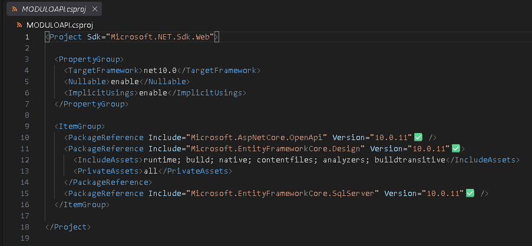
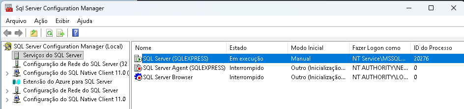
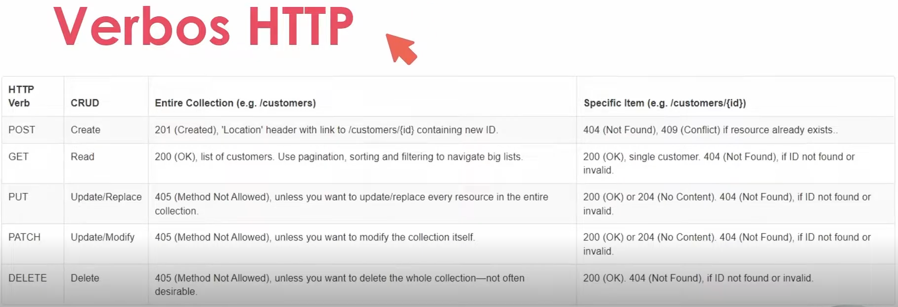

# Entity Framework e CRUD

## Instalação dos pacotes necessários para trabalhar com o EF

1. Na linha de comando do terminal digite os comandos abaixo para instalação dos pacotes.
    - Ferramenta para executar comandos do EF no console, ela é executada apenas uma vez. Não sendo necessário executar para outros projetos.
        -> dotnet tool install --global dotnet-ef

    - Pacote do EF. Esse comando deve ser executado em cada projeto criado
        -> dotnet add package Microsoft.EntityFrameworkCore.Design

    - Pacote do EF do SqlServer. Esse comando deve ser executado em cada projeto criado
        -> dotnet add package Microsoft.EntityFrameworkCore.SqlServer

2. Conferir a instalação no arquivo csproj conforme imagem abaixo.



## Criando a classe entidade

1. Criar uma nova pasta chamada Entities onde serão criada as classes que serão transformada em tabelas do banco de dados

2. Criar a classe Contatos.cs dentro da pasta Entities.

```csharp
    public class Contatos
    {
        public int Id { get; set; }
        public string Nome { get; set; }
        public string Telefone { get; set; }
        public bool Ativo { get; set; }
        
    }
```
## Criando o Contexto

    Contexto é uma classe que centraliza todas as informações em um determinado banco de dados

    1. Criar uma pasta chamada Context
    2. Criar uma classe chamada AgendaContext.cs
    3. Criar uma herança da classe DbContext para a AgendaContext
    4. Criar o contrustor da classe que vai receber a configuração do banco de dados
    5. Criar a propriedade DbSet<> que vai representar a tabela

```csharp
using Microsoft.EntityFrameworkCore;
using MODULOAPI.Entities;

namespace MODULOAPI.Context
{
    public class AgendaContext : DbContext
    {
        public AgendaContext(DbContextOptions<AgendaContext> options) : base(options)
        {

        }
        public DbSet<Contatos> Contatos { get; set; }
    }
}
```
## Configurando a conexão

1. Cadastrar a conexão com o banco no arquivo appsettings.Development.json. Na ConnectionString vai informações sobre o servidor, o nome do banco e o tipo de autenticação.

```Json
{
  "Logging": {
    "LogLevel": {
      "Default": "Information",
      "Microsoft.AspNetCore": "Warning"
    }
  },
  "ConnectionStrings": {
    "ConexaoPadrao": "Server=localhost\\sqlexpress; Initial Catalog=Agenda; Integrated Security=True"
  }
}
```
2. Configurar o context passando a string de conexão.
Na classe Program.cs adicionar o código abaixo
Adiconar os usings
```csharp
using ModuloAPI.Context;
using Microsoft.EntityFrameworkCore;
```

3. Abaixo de var builder no começo do código colocar a instrução abaixo.
```csharp
builder.Services.AddDbContext<AgendaContext>(options => options.UseSqlServer(builder.Configuration.GetConnectionString("ConexaoPadrao")));
```
## Entendendo as migrations

Migrations são mapeamentos que o EF faz para transformar as classes em tabelas. As classes que serão transformadas em tabelas no banco estão referenciadas na classe context através do DbSet, ou seja, toda tabela do banco tem que ter um DbSet.

1. Garantir que o banco de dados esteja rodando.
Abrir o Sql Server Configuration Management e ver se a instancia do SQL Server (SQLEXPRESS) está em execução.



2. No terminal do vscode digitar o comando abaixo que vai criar a Migration mas ainda não vai aplicar no banco de dados.

-> dotnet-ef migrations add CriacaoTabelaContato

3. Ainda no terminal digitar o comando que vai aplicar a migration no banco.

-> dotnet-ef database update

## Criando a controller e o Endpoint de create

1. Criar a pasta Controllers.
2. Criar uma classe com o nome ContatoControler.cs com o código abaixo.
```csharp
    using Microsoft.AspNetCore.Mvc;
    using MODULOAPI.Context;
    using MODULOAPI.Entities;

    namespace MODULOAPI.Controllers
    {
        [ApiController]
        [Route("api/[controller]")]
        public class ContatoController : ControllerBase
        {
            private readonly AgendaContext _context;

            public ContatoController(AgendaContext context)
            {
                _context = context;
            }

            [HttpPost]
            public IActionResult Create(Contatos contato)
            {
                _context.Add(contato);
                _context.SaveChanges();
                return Ok(contato);
            }

        }
    }
```

### Acertando a classe Program.cs para utilização do swagger para testes

```csharp
using MODULOAPI.Context;
using Microsoft.EntityFrameworkCore;

// Inicializa o construtor da aplicação web, preparando as configurações e serviços
var builder = WebApplication.CreateBuilder(args);

// Habilita o suporte a Controllers tradicionais (classes de controle dedicadas, como o seu ContatoController)
builder.Services.AddControllers();

// Configura o Entity Framework Core para conectar-se ao banco de dados SQL Server 
// usando a string de conexão "ConexaoPadrao" definida no arquivo appsettings.json
builder.Services.AddDbContext<AgendaContext>(options =>
    options.UseSqlServer(builder.Configuration.GetConnectionString("ConexaoPadrao")));

// Ativa o explorador de endpoints, essencial para que o Swagger consiga rastrear e mapear as rotas da API
builder.Services.AddEndpointsApiExplorer();

// Adiciona os serviços do gerador do Swagger para criar a especificação técnica da API
builder.Services.AddSwaggerGen();

// Finaliza a fase de configuração dos serviços e constrói de fato a aplicação web
var app = builder.Build();

// Verifica se o projeto está rodando em ambiente de Desenvolvimento local
if (app.Environment.IsDevelopment())
{
    // Gera o arquivo de metadados no formato JSON interno que descreve as rotas da aplicação
    app.UseSwagger();
    
    // Habilita a interface visual colorida do Swagger no navegador (geralmente acessada em /swagger)
    app.UseSwaggerUI();
}

// Mapeia de forma automática todas as rotas declaradas nos seus arquivos de Controller ([Route("api/[controller]")])
app.MapControllers();

// Cria uma rota de teste manual e direta (Minimal API) apenas para validar se o servidor web está respondendo corretamente
app.MapGet("/weatherforecast", () => new[] { new WeatherForecast(DateOnly.FromDateTime(DateTime.Now), 25, "Warm") })
    .WithName("GetWeatherForecast")
    .WithOpenApi(); // Diz ao Swagger para incluir essa rota direta na documentação visual

// Coloca o servidor web no ar e mantém a aplicação rodando à espera de requisições HTTP
app.Run();

// Modelo simples de dados (Record) usado apenas como estrutura para a resposta da rota de teste acima
record WeatherForecast(DateOnly Date, int TemperatureC, string? Summary);

```

## Criando o endpoint obter por ID

1. Na classe ContatoController.cs incluir o código abaixo

```csharp
   [HttpGet]
   public IActionResult ObterPorId(int id)
   {
       var contato = _context.Contatos.Find(id);

       if (contato == null)
           return NotFound();
       return Ok(contato);
   }
```

## Criando o endpoint Update

1. Na classe ContatoController.cs incluir o código abaixo

```csharp
    [HttpPut("{id}")]
    public IActionResult Atualizar(int id, Contatos contato)
    {
        var contatoBanco = _context.Contatos.Find(id);

        if (contatoBanco == null)
        {
            return NotFound();
        }

        contatoBanco.Nome = contato.Nome;
        contatoBanco.Telefone = contato.Telefone;
        contatoBanco.Ativo = contato.Ativo;

        _context.Contatos.Update(contatoBanco);
        _context.SaveChanges();

        return Ok(contatoBanco);
    }
```

## Criando o endpoint Delete

1. Na classe ContatoController.cs incluir o código abaixo

```csharp
    [HttpDelete("{id}")]
    public IActionResult Deletar(int id)
    {
        var contatoBanco = _context.Contatos.Find(id);

        if (contatoBanco == null)
        {
            return NotFound();
        }

        _context.Contatos.Remove(contatoBanco);
        _context.SaveChanges();

        return NoContent();
    }

```

## Criando o endpoint obter por nome

1. Na classe ContatoController.cs incluir o código abaixo
```csharp
    [HttpGet("ObterPorNome")]
    public IActionResult ObterPorNome(string nome)
    {
         var contatos = _context.Contatos.Where(x => x.Nome.Contains(nome));
         return Ok(contatos);
    }

```


## Verbos Http
